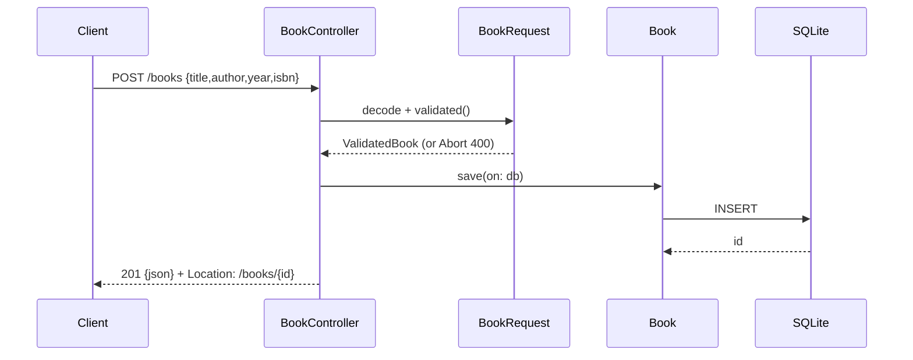

# Flow

A `POST /books` request decodes into a lenient `BookRequest`, then `validated()`
trims and checks the payload — required `title`/`author`, an in-range `year`, and
a well-shaped ISBN — throwing `Abort(.badRequest)` that aggregates every problem.
On success a `Book` Fluent model is persisted to the file-backed SQLite database,
and the handler returns `201 Created` with the JSON body and a `Location` header.
Notable: validation aggregates all errors into one message; PUT uses full-replace
semantics (omitted optional fields are cleared); the ISBN check validates shape
only, not the check digit.
