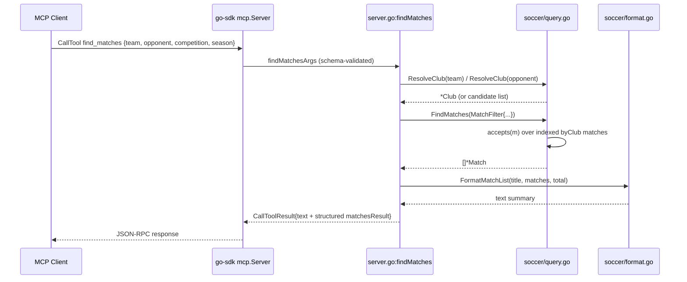

# Flow

The most representative flow is an MCP client calling `find_matches` for two
teams (e.g. Flamengo vs Fluminense) — the "show me all X vs Y matches" query at
the centre of the spec.

A `find_matches` call is decoded by the SDK into `findMatchesArgs` (schema
derived from the Go struct). The handler resolves each team name to a stable
club ID via `ResolveClub` (which applies accent/suffix normalization and can
return disambiguation candidates instead of a single club). It builds a
`MatchFilter` and calls `FindMatches`, which scans the pre-built `byClub` index
and applies `accepts()` for venue/competition/season/date-range/stage
predicates. Results are rendered by `FormatMatchList` into a human-readable text
block, and the same data is returned as typed structured content. The whole
graph is loaded once at start-up and served read-only from memory, so no I/O
happens on the request path.

Deviations from common patterns worth noting (factual):
- No database; all queries run against in-memory slices/indexes built at load.
- Ambiguous team names do not error — `ResolveClub` returns candidate lists and
  the handler surfaces them for disambiguation.
- No pagination; results are capped by a caller `limit` (bounded by `clamp`).
- Errors are returned as MCP tool errors (`IsError`), not transport failures.
