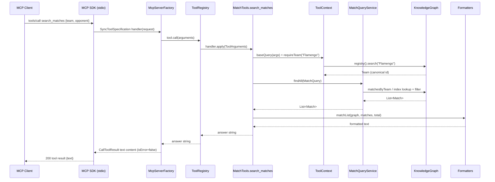

# Flow

Representative happy path: an MCP client calls the `search_matches` tool (e.g. all Flamengo vs
Fluminense matches). This is the flow a user of the generated server hits first.

At startup `DataLoader.load()` reads the six CSVs, canonicalises club spellings through
`TeamRegistry`/`TeamNameNormalizer`, merges overlapping fixtures across files, and builds the
`KnowledgeGraph` adjacency indexes once. Each `tools/call` then resolves the club name to a
canonical `Team`, assembles a `MatchQuery` from the arguments (`ToolContext.baseQuery` +
venue/order/limit), runs it against the pre-computed indexes via `MatchQueryService.findAll`
(a hash lookup rather than a CSV scan), and renders the result to a plain-text answer via
`Formatters`. The answer is wrapped in a single MCP text content block.

Notable characteristics (factual):

- Answers are **plain human-readable text**, not structured JSON — formatting lives in
  `Formatters` and each tool builds a `StringBuilder` header + body.
- Argument handling is defensive: unknown clubs, unknown competitions, and missing required args
  raise `ToolException`, which is surfaced to the client as an MCP *error result* (not a crash),
  and unexpected `RuntimeException`s are likewise caught and returned as errors.
- Club-name ambiguity is handled explicitly: `search()` returns ranked candidates, the best match
  is used, and an "also matches" note is appended when other namesake clubs exist.
- All data is loaded eagerly into memory at startup; queries are synchronous and index-backed.
  There is no database, no pagination cursor (just a `limit`), and no external API calls in the
  core path (optional API-Football/TheSportsDB sources from the spec are not integrated).
- stdio discipline is enforced: JSON-RPC on `stdout`, all diagnostics on `stderr`; stdin EOF
  triggers a graceful shutdown with a 3s grace window for in-flight requests.
