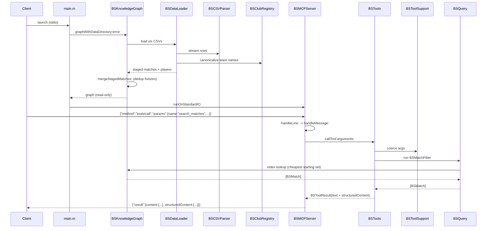

# Flow

At start-up `main.m` builds the knowledge graph once: `BSDataLoader` streams the six CSV files through `BSCSVParser`, resolving every raw team string to a canonical `BSClub` via `BSClubRegistry`, and `BSKnowledgeGraph -mergeStagedMatches:` collapses the fixtures that appear in more than one file into a single node (so the 2012–2019 Brasileirão seasons are not triple-counted). The graph is then read-only, so every query is an index lookup. `BSMCPServer -runOnStandardIO` reads one JSON-RPC line at a time; a `tools/call` for `search_matches` is coerced by `BSToolSupport`, expressed as a `BSMatchFilter`, and run by `BSQuery`, which chooses the cheapest starting index (a club's ~900 matches rather than all ~16,765) to stay inside the 2-second budget. The tool returns a `BSToolResult` carrying both formatted text and a complete `structuredContent` object, which the server wraps in a JSON-RPC response. Notable characteristics: no HTTP and no external database (all in-memory); diagnostics go only to stderr to keep the stdout JSON stream clean; tool-level failures (e.g. an unknown club) are returned as `isError` results with "did you mean…?" suggestions rather than JSON-RPC errors; and there is no result caching, relying instead on index selection for performance.
