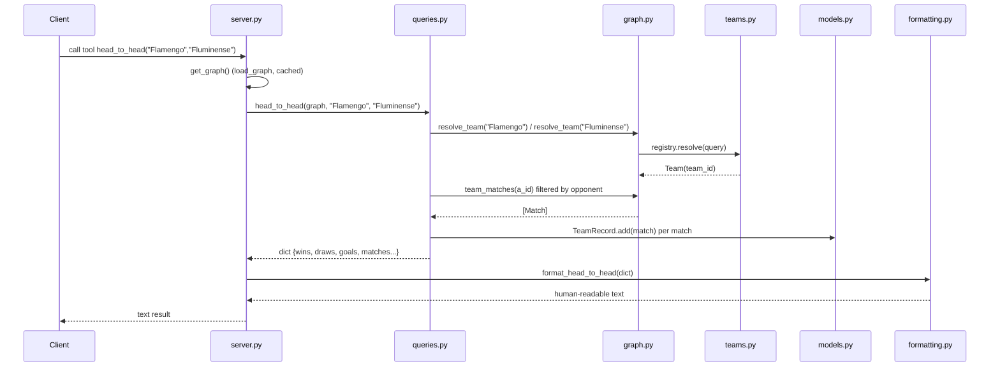

# Flow

A tool call resolves free-text team names through the `TeamRegistry` (accent-
and suffix-tolerant, e.g. "Flamengo", "flamengo-rj", "Palmeiras-SP" all map to a
canonical id), pulls the pre-indexed matches for the team from the
`KnowledgeGraph`, filters to the opponent, aggregates with `TeamRecord`, and
returns a JSON-friendly dict which the `formatting` layer renders as text the
LLM can quote. The graph itself is built once per process from the six CSVs by
`loader.load_dataset` — which de-duplicates the same fixture appearing in
multiple source files within a 45-day window so standings and records are not
triple-counted. Lookup failures are turned into guidance (`UnknownTeamError`
with suggestions) rather than exceptions, via the `_guard` wrapper in `server.py`.
Notable: pure standard-library data layer (no pandas); the only runtime
dependency is the MCP SDK. Standings deliberately withhold a "champion" label
when the source data is missing fixtures for that season.
