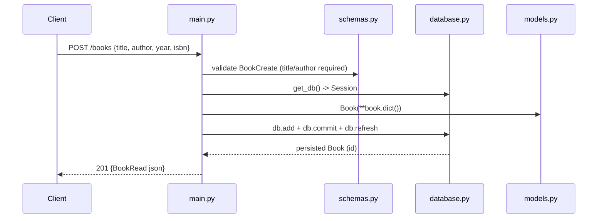

# Flow

A `POST /books` request is validated against the `BookCreate` schema (title and author
required, min_length=1). A per-request SQLAlchemy session is opened via the `get_db()`
FastAPI dependency, a `Book` ORM row is created and committed to the SQLite `books.db`,
then refreshed to obtain the auto-assigned id and returned as JSON with status 201.
Validation failures are handled by FastAPI's default handler and return **422** (not 400).
DB tables are created in the `startup` event handler.
