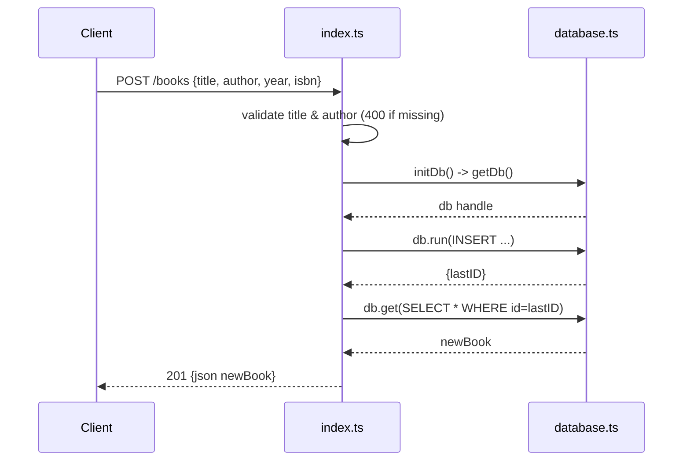

# Flow

A `POST /books` request first validates that `title` and `author` are present, returning 400 otherwise. It lazily opens a single shared SQLite connection (`initDb` memoizes the promise), inserts the row, re-selects it by `lastID`, and returns the persisted book with 201. The DB connection is opened once and reused across requests. Note: the test file's `beforeAll` seeds `./test-books.db`, but `getDb`'s default path is `./books.db`, so the app under test persists to `books.db` — the seeding is a no-op for the app, though tests still pass because they create/read within the same run.
