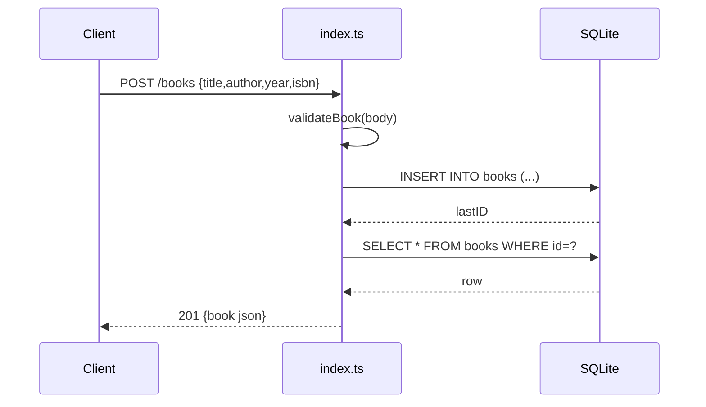

# Flow

A `POST /books` request is validated (`title` and `author` required, else 400), inserted into
the in-memory SQLite table, then re-selected by `lastID` and returned as JSON with 201. All
handlers use the callback-based `sqlite3` driver directly. Persistence is in-memory only, so
data does not survive a restart. No pagination on the list route; `?author=` filters via an
exact-match SQL WHERE clause.
