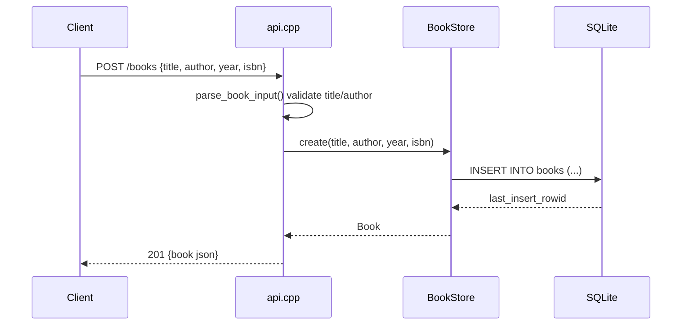

# Flow

A `POST /books` request is parsed and validated by `parse_book_input()`, which
rejects malformed JSON, missing/empty `title` or `author`, and wrong-typed
`year`/`isbn` with `400 {error}`. On success `BookStore::create` inserts a row
under a mutex-guarded prepared statement and returns the row with its generated
id, serialized as `201`. Persistence is real SQLite (file `books.db` by default,
`:memory:` in tests). Errors thrown anywhere are caught by a server-wide
exception handler and returned as `500 {error}`.
