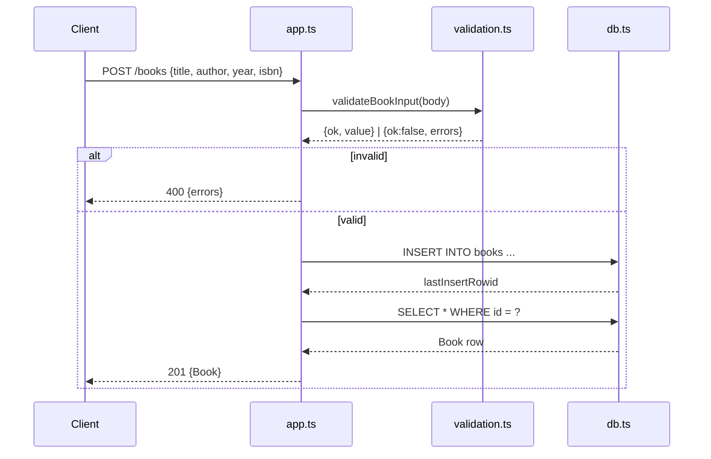

# Flow

A `POST /books` request first runs `validateBookInput`, which rejects non-object
bodies and missing/blank title or author (400). On success it inserts via a
parameterized prepared statement into the `node:sqlite` DB, re-selects the row to
return the DB-assigned id, and responds 201. All routes use parameterized queries
(no SQL injection surface). The DB is dependency-injected through `createApp`, so
tests run against `:memory:`. Error handling is present throughout: id parsing
(400 on non-integer), 404 on absent rows, and a JSON-syntax error middleware.
