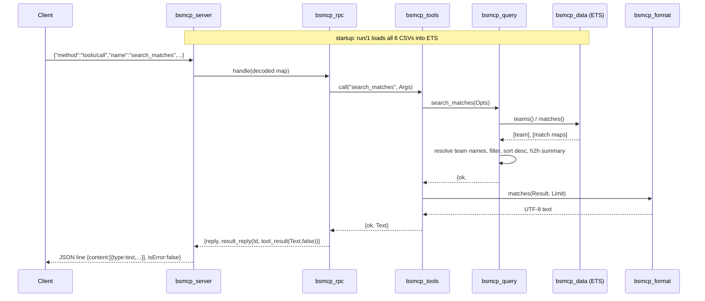

# Flow

On startup `bsmcp_server:run/1` sets stdio to binary/unicode, then
`bsmcp_data:load/1` spawns a monitored holder process that reads all six CSVs
into named public ETS tables, unifying every source into one match store keyed
by a canonical team pair and de-duplicating overlapping records on
`{date ±1 day, geo-stripped home/away pair}`. The main loop then reads one line
at a time from stdin, decodes it as JSON, and passes the map to
`bsmcp_rpc:handle/1`. For a `tools/call`, `bsmcp_tools:call/2` coerces arguments,
invokes the matching `bsmcp_query` function (which resolves user team strings to
canonical names via `bsmcp_names`, filters `bsmcp_data:matches/0`, and computes
statistics), then `bsmcp_format` renders the result to human-readable UTF-8 text.
The reply is re-encoded and written back as a single newline-terminated JSON
line.

Notable characteristics: the loop is strictly single-threaded and synchronous
(one request processed to completion before the next line is read); tool-level
failures are returned inside the MCP result with `isError: true` rather than as
JSON-RPC errors, so the LLM can see them; every tool handler is wrapped in a
try/catch in `call/2` that turns any crash into an error result including the
Erlang stack trace; queries scan the full ETS match list per call (no secondary
indexes), and player-club searches note that the FIFA 19 dataset lacks Brazilian
league clubs.
