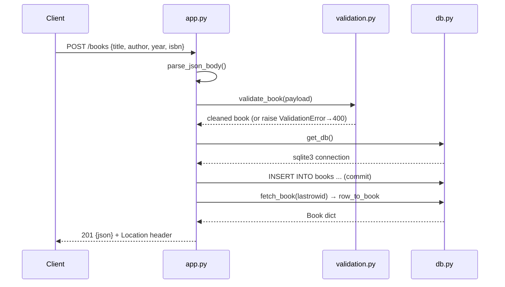

# Flow

A `POST /books` request is parsed as JSON (415-style 400 if the Content-Type is
not `application/json`), validated by `validation.py:validate_book` (title and
author required; year and isbn optional with format checks; unknown fields
rejected), then inserted into SQLite through the per-request connection from
`db.py:get_db`. A duplicate ISBN violates the UNIQUE constraint and is caught as
a 409. On success the freshly-stored row is re-fetched and returned as JSON with
a 201 status and a `Location` header. Input validation, error handling, and
correct HTTP status codes are all present; persistence is a real SQLite file.
