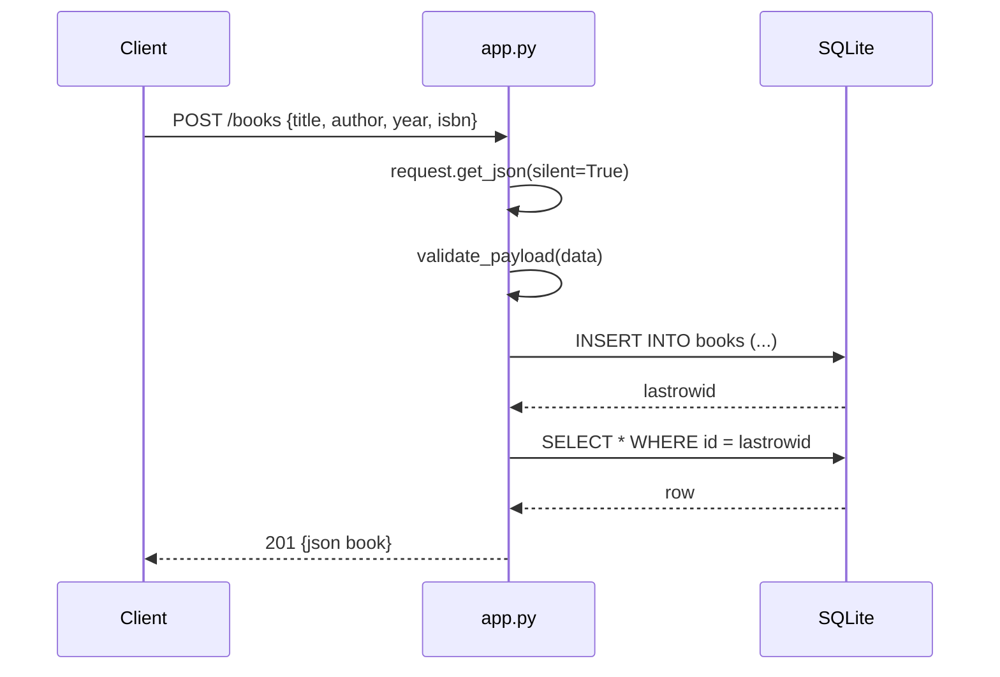

# Flow

A `POST /books` request parses the JSON body defensively (`silent=True`, returning 400 on non-JSON), runs `validate_payload` which requires non-empty string `title` and `author` and type-checks optional `year`/`isbn`, inserts via a per-request `sqlite3` connection stored on Flask's `g`, then re-selects the inserted row to echo the assigned `id`. Connections are opened lazily per request (`get_db`) and closed on `teardown_appcontext`. Validation is present on both create (full) and update (partial); reads/deletes return 404 for missing ids.
