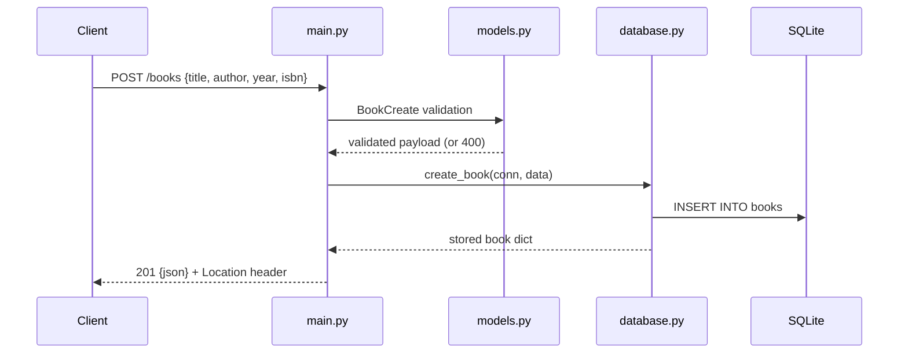

# Flow

A `POST /books` request is validated by the `BookCreate` Pydantic model (required `title`/`author`, optional bounded `year`, normalised `isbn`); validation failures are caught by a custom `RequestValidationError` handler returning a uniform 400 `{detail, errors}` body. On success a per-request SQLite connection (dependency-injected via `get_conn`) inserts the row; a duplicate ISBN surfaces as `sqlite3.IntegrityError` → 409. The stored resource is returned as 201 with a `Location` header. Notable: connection-per-request pattern, custom exception handlers for uniform JSON errors, both PUT (full replace) and PATCH (partial) supported beyond the spec, LIKE-wildcard escaping on the author filter.
