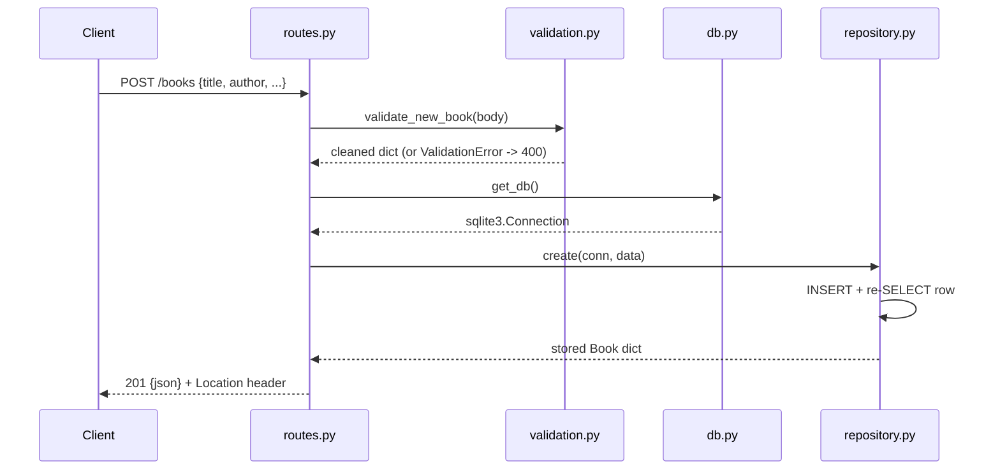

# Flow

A `POST /books` request has its JSON body parsed leniently (`force=True, silent=True`) and passed to `validate_new_book`, which collects *all* field problems and raises `ValidationError` (rendered as a 400 with a `details` array) on any failure. On success the request-scoped SQLite connection is obtained via `get_db()`, `repository.create` inserts the row and re-reads it to return the canonical stored representation (including `id` and timestamps), and the handler responds 201 with a `Location` header pointing at the new resource. Validation is deliberately Flask-free so it is unit-testable; the storage layer takes an explicit connection so it is independent of Flask's request context. Input validation, JSON error handling, and correct status codes (201/200/204/400/404) are all present.
