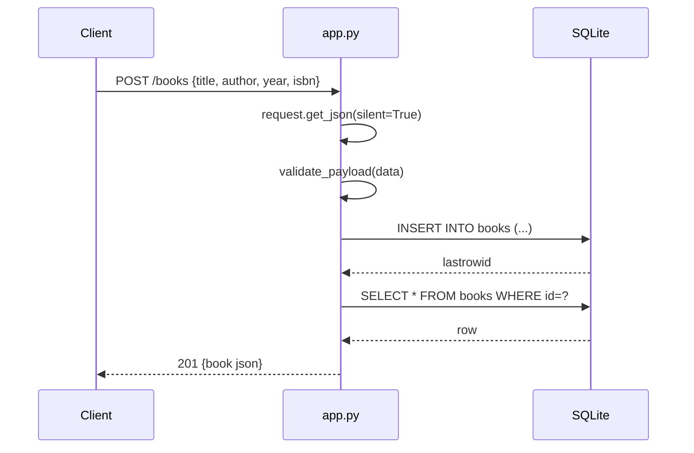

# Flow

A `POST /books` parses the JSON body (400 on invalid JSON), runs
`validate_payload` which requires non-empty string `title` and `author` and
type-checks optional `year`/`isbn` (400 on error), inserts the row into SQLite,
then re-selects and returns the created book as JSON with 201. Each request gets
a per-request SQLite connection stored on Flask's `g` and closed on teardown.
Validation, error handling, and correct status codes are all present.
