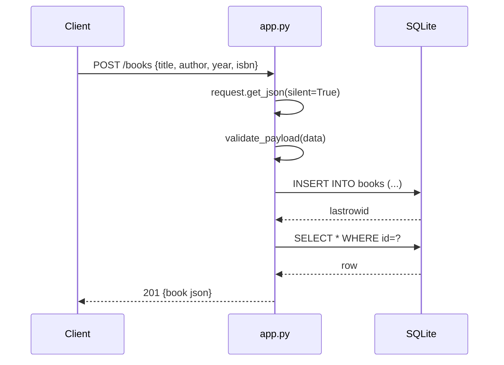

# Flow

A `POST /books` request parses the JSON body defensively (`get_json(silent=True)`,
returning 400 on invalid JSON), validates that `title` and `author` are non-empty
strings via `validate_payload`, inserts the row into the per-request SQLite
connection (opened lazily in `get_db()` and closed in a `teardown_appcontext`
hook), then reads the inserted row back and returns it as JSON with 201. Updates
use `partial=True` validation so only supplied fields are changed. The schema is
created once at `create_app` time. No pagination; author filtering is an exact
match.
