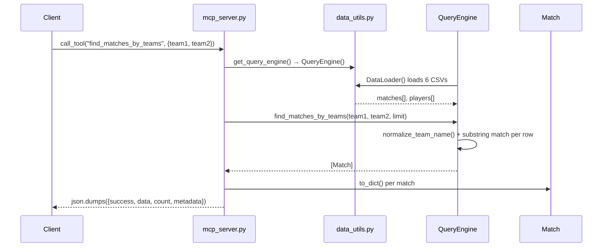

# Flow

The most representative flow is an MCP client calling `find_matches_by_teams` — the first capability in the spec ("Show me all Flamengo vs Fluminense matches").

A tool call constructs a fresh `QueryEngine` on every invocation via `get_query_engine()`, which in turn instantiates a new `DataLoader` that re-reads and re-parses all six CSV files (~26K match rows + ~18K player rows) from disk into memory. The engine then linearly scans `self.loader.matches`, normalizing each team name (regex strips state suffix and parenthetical text) and doing case-insensitive substring matching for both teams. Results are wrapped into a JSON envelope and returned as a string.

Deviations from common patterns:
- **No caching of loaded data** — every tool call and every FastAPI request reloads and reparses all CSVs, so there is no shared state and repeated queries pay full I/O + parse cost each time. The module-level `query_engine` in `api.py` is built once at import, but each route handler still constructs its own `QueryEngine()` instead of using it.
- **No pagination or indexing** — filtering is O(n) linear scans; `find_matches_by_teams` stops early once `limit` is reached, but `find_matches_by_team` does not.
- **No input validation** on team/competition strings; empty or unmatched names simply return empty result sets.
- **Substring matching** means normalized "Flamengo" can match unintended teams containing that substring, and season/competition are re-filtered redundantly in the MCP layer after the engine already filtered them.
- **`Match.id` is unset**, so ID-based lookups always miss.
