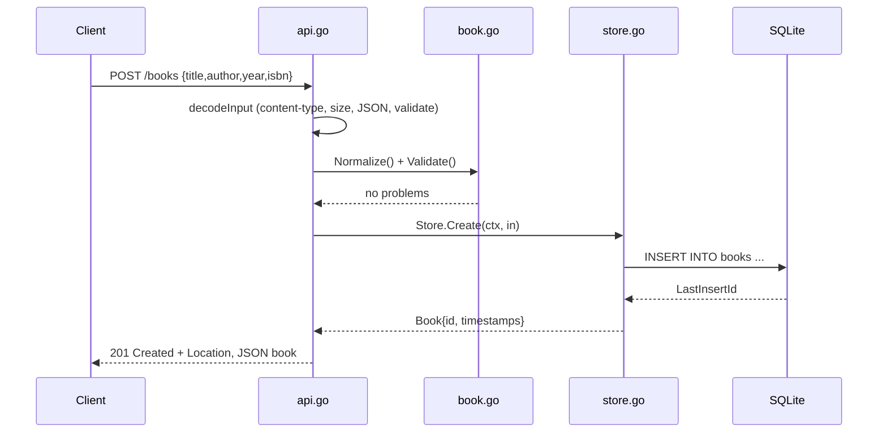

# Flow

A `POST /books` request is decoded by `decodeInput`, which enforces the
`application/json` content type, a 1 MiB body cap, strict JSON decoding
(`DisallowUnknownFields` + rejection of trailing content), then normalizes and
validates the payload (title/author required, year range, ISBN check digit).
On success `Store.Create` inserts the row and returns the book with its
generated ID and RFC3339 timestamps; the handler responds `201` with a
`Location` header. A duplicate non-empty ISBN maps to `409`, validation
failures to `422`, and malformed bodies to `400`/`413`/`415`. All handlers run
behind `recoverPanic` middleware that converts a panic into a JSON `500`.
Notable: validation failures return `422` (not `400`); layering keeps the store
free of HTTP concerns via sentinel errors.
