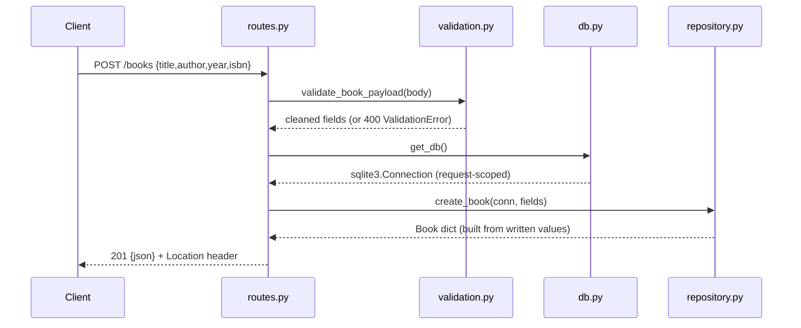

# Flow

A `POST /books` request is first parsed as JSON (`_json_body`, `force=True`) and validated/normalised by `validation.py:validate_book_payload`, which requires non-empty `title` and `author`, rejects control characters and unknown fields, and coerces `year`/`isbn`. On success the request-scoped SQLite connection from `db.py:get_db()` is passed to `repository.py:create_book`, which does a parameterised `INSERT` inside a transaction and returns the new row (constructed from the written values plus `lastrowid`, avoiding a read-back race). The handler returns `201` with the serialized book and a `Location` header. Validation failures surface as `400` JSON via the `ApiError` handler; unexpected errors become a `500` JSON body. Input validation, error handling, and correct status codes are all present.
