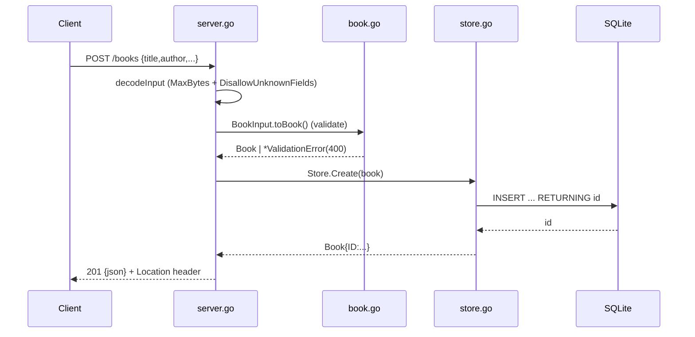

# Flow

A `POST /books` request is decoded with a 1 MiB body cap and `DisallowUnknownFields`,
then validated by `BookInput.toBook()` — `title` and `author` are required (trimmed),
`year` is range-checked (0–2200). Validation failures return `400` with a per-field
`fields` map and persist nothing. On success the row is inserted into SQLite, the
generated ID is attached, and the book is returned as `201` JSON with a `Location`
header. Errors are centralised in `writeError`, which maps `*ValidationError`→400,
`ErrNotFound`→404, and anything else→500. The server uses signal-based graceful
shutdown and a single SQLite connection (write serialisation / stable `:memory:`).
