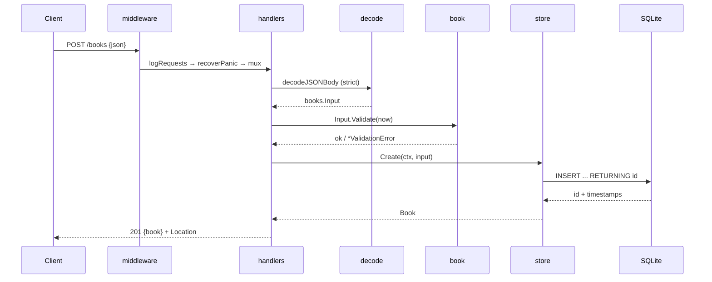

# Flow

A `POST /books` passes through the log and panic-recovery middleware, then the ServeMux dispatches by method+path. The handler strictly decodes the JSON body (rejecting wrong content-type, unknown fields, trailing data, and oversized bodies), validates and normalizes the input (trimming, ISBN canonicalization, year bounds), and inserts via the single-connection SQLite store. On success it returns 201 with the created book and a `Location` header. Validation failures return 422 with a per-field `details` map; a duplicate ISBN returns 409; not-found returns 404. Timestamps are stored as RFC3339Nano and the store maps a driver-level UNIQUE violation to `ErrDuplicateISBN`.
