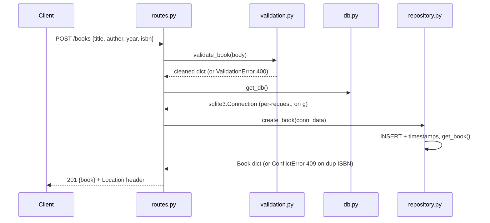

# Flow

A `POST /books` request first parses the JSON body (`_json_body`, forced so a
missing `Content-Type` still works). `validation.py:validate_book` trims and
type-checks each field, collecting all field errors together and raising a
`ValidationError` (400) if `title`/`author` are missing or any field is bad.
On success, `db.py:get_db` lazily opens a per-request SQLite connection stored
on Flask's `g`, and `repository.py:create_book` inserts the row with
`created_at`/`updated_at` timestamps, translating a duplicate-ISBN
`IntegrityError` into a `ConflictError` (409). The stored book is returned as
`201` JSON with a `Location` header pointing at the new resource. Errors at any
layer are rendered as a uniform JSON body by `errors.py`.

Notable: clean layered separation (HTTP / validation / storage), all field
errors reported at once, case-insensitive author filtering, pagination with
`X-Total-Count`, unique-ISBN conflict handling, and a health check that probes
the DB — several features beyond the task's minimum spec.
