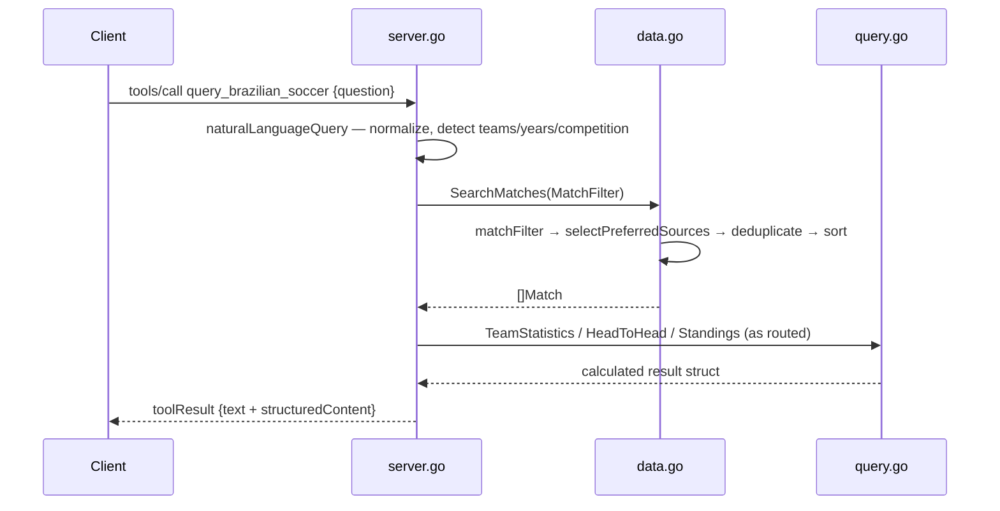

# Flow

A `tools/call` for `query_brazilian_soccer` runs `naturalLanguageQuery`, which normalizes the question (accent-folding), extracts years via regex, infers competition and team names against the loaded team index, then routes to the most specific handler (player search, head-to-head, standings/champion/relegation, bracket, team competitions, team record, aggregate statistics, or a plain match search). The chosen handler calls `DataStore.SearchMatches`, which applies competition/season/date/round/stage/source predicates, collapses overlapping source files via `selectPreferredSources`, deduplicates physical matches, and date-sorts. Analytics in `query.go` compute results from scores rather than reading precomputed values. Every result is returned both as human-readable text and as `structuredContent`. Notable: the protocol layer is hand-rolled on the standard library (no MCP SDK dependency); a per-session `lastMatches` cache lets a follow-up "What was the score?" resolve against the previously returned match.
