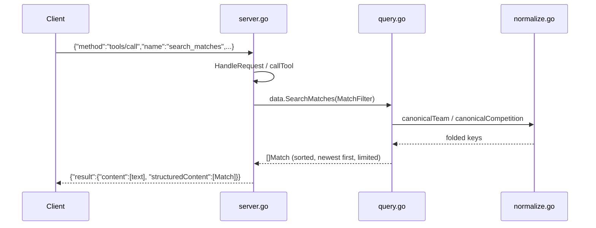

# Flow

A `tools/call` for `search_matches` is decoded from the stdio JSON-RPC stream by
`RunServer` → `HandleRequest` → `callTool`, which builds a `MatchFilter` from the string/int
arguments and calls `DataStore.SearchMatches`. Filtering canonicalizes team and competition
names (accent/case folding, state-suffix stripping, club aliases) so `Flamengo`, `Flamengo-RJ`,
and long forms match the same entity. Results are stable-sorted newest-first, capped at the
requested limit (default 50, max 500), and returned both as a pretty-printed text block and as
`structuredContent`. Aggregate tools (`team_statistics`, `standings`, `head_to_head`, …) run the
same filter but additionally deduplicate fixtures that appear in more than one CSV and pick one
authoritative source per competition/season via `selectPreferredSources`.

Notable: no third-party dependencies (stdlib `encoding/json` + `encoding/csv` only); the loader
fails hard if any CSV is missing rather than silently degrading; search deliberately keeps
per-source duplicate rows while calculations deduplicate them.
