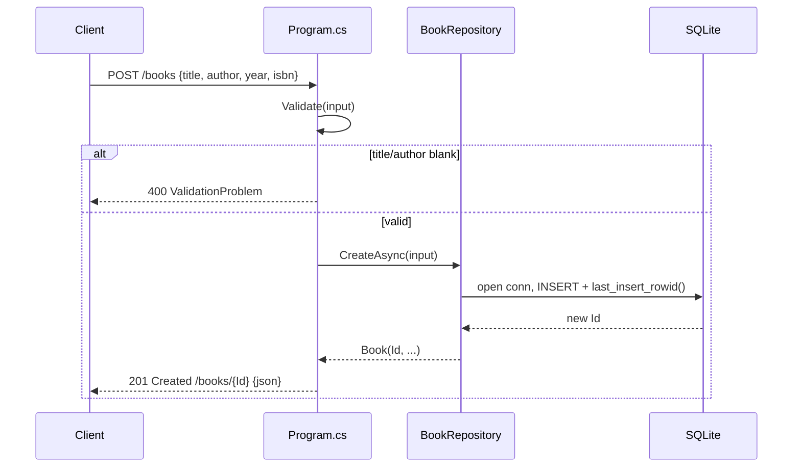

# Flow

A `POST /books` request is model-bound into a `BookInput` record, then run through the local `Validate()` helper which rejects blank `title`/`author` with a 400 `ValidationProblem`. On success the handler calls the DI-registered singleton `BookRepository.CreateAsync`, which opens a fresh `SqliteConnection`, runs a parameterized `INSERT` followed by `SELECT last_insert_rowid()`, and constructs a trimmed `Book`. The handler returns `201 Created` with a `/books/{id}` location and the JSON body.

Notable characteristics:
- Each repository method opens and disposes its own connection (no pooled/shared connection or transaction); the schema is created once at startup via `InitializeAsync`.
- The `BookRepository` is a singleton, but SQLite access is per-call connection-scoped.
- Validation covers only presence of `title`/`author`; `year`/`isbn` are unconstrained, and there is no global exception handling around DB calls.
- Title/author are `.Trim()`-normalized before persistence; the author filter uses a `LIKE %...%` substring match rather than exact equality.
