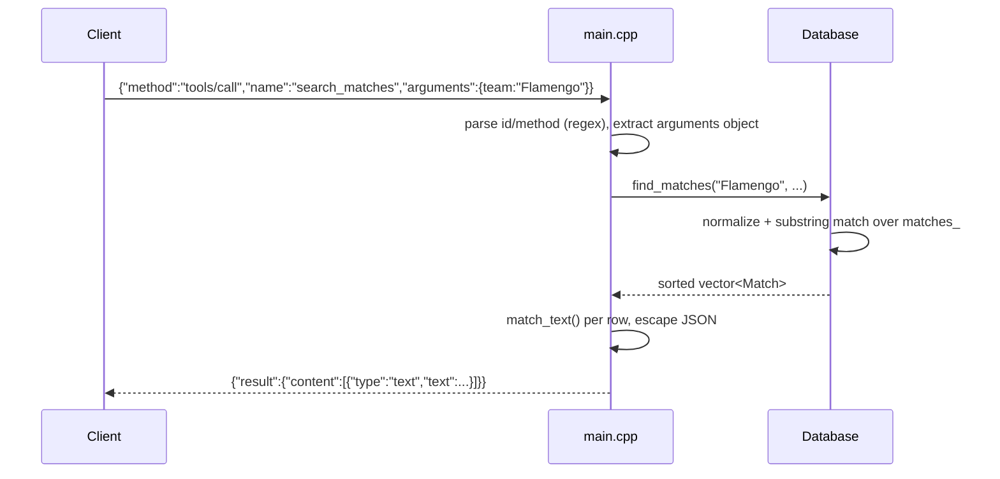

# Flow

On startup `main()` calls `Database::load(dir)`, streaming all six CSVs into
`matches_`/`players_` once; queries then run in-memory. Team names are matched via
`normalize()`, which lowercases, strips accents (hand-rolled UTF-8 folding of common
Portuguese C3-prefixed bytes) and collapses whitespace, so "Palmeiras-SP" matches
"palmeiras".

Notable characteristics:
- **JSON parsing is regex/hand-rolled**, not a real parser — adequate for the flat
  request shapes but brittle for nested/escaped values.
- **No pagination cursor**; `limit` truncates after full scan (linear per query).
- **Standings double-count overlapping Brasileirão seasons** — both
  `Brasileirao_Matches.csv` (2012–2022) and `novo_campeonato_brasileiro.csv`
  (2003–2019) load under competition "Brasileirao", so 2012–2019 matches appear twice.
- Error handling on load returns non-zero exit if matches or players are empty.
