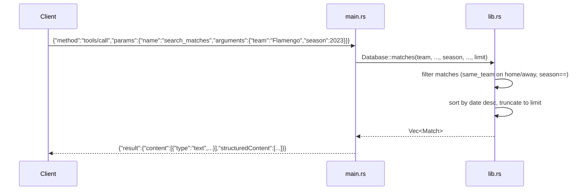

# Flow

At startup `main()` loads all six CSVs once via `Database::load_from_dir` (default `data/kaggle`, overridable with `SOCCER_DATA_DIR`), then reads newline-delimited JSON-RPC requests from stdin in a loop. A `tools/call` for `search_matches` dispatches through `result()` to `Database::matches`, which filters the in-memory `Vec<Match>` using accent/suffix-normalized team matching (`same_team`) and optional competition/season/date bounds, sorts newest-first, truncates to `limit`, and returns the rows both as pretty-printed text and as `structuredContent`. Team-name normalization (NFD accent-stripping, state-suffix removal, filler-word dropping) is applied consistently across match and player queries. Notable: all data is held in memory (no index, linear scans per query); malformed request lines are silently skipped; required-arg validation returns a JSON-RPC -32602 error.
