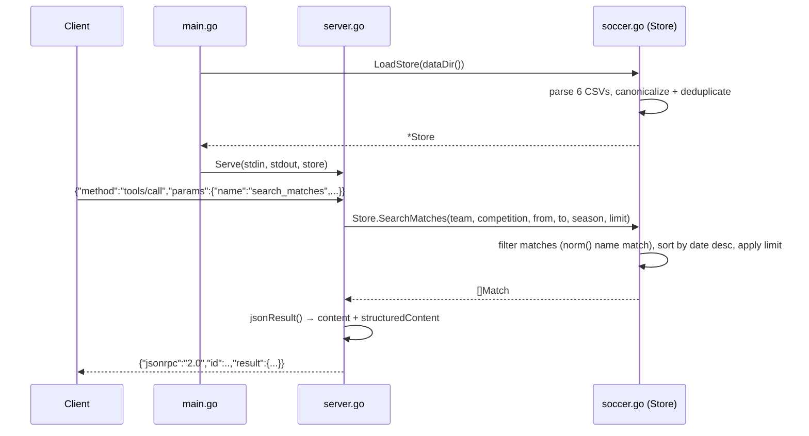

# Flow

At startup `main.go` calls `LoadStore`, which reads all six Kaggle CSVs into slices of `Match`/`Player`, canonicalizes competition names, and deduplicates overlapping fixtures via a normalized key. `Serve` then reads newline-delimited JSON-RPC requests with a `bufio.Scanner`; for a `tools/call` it decodes the tool name and arguments, dispatches through `callTool` to the matching `Store` method, wraps the return value with `jsonResult` (which emits both a text `content` block and a typed `structuredContent`), and encodes one JSON response per line.

Notable characteristics:
- All data is loaded eagerly into memory; every query is a linear scan over the slice.
- Team-name matching is fuzzy: `norm()` lowercases, strips accents, drops a trailing 2-letter state suffix (e.g. `-SP`), collapses whitespace, and maps `atletico`→`athletico`; `contains()` does substring matching, so an empty filter matches everything.
- A malformed JSON-RPC line is silently skipped (`continue`) rather than erroring.
- `atoi()` and `dateOnly()` swallow parse errors (default 0 / passthrough), so bad CSV cells degrade silently rather than failing the load.
- No pagination beyond `limit`, no authentication, and no concurrency — the request loop is strictly sequential.
