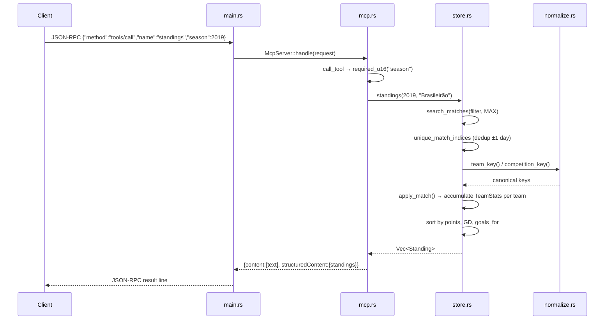

# Flow

At startup `main.rs` calls `SoccerStore::load`, which reads all six CSVs, then builds a deduplicated fixture index by canonicalizing `(date, season, competition, home_team, away_team)` — collapsing rows that repeat across the five overlapping match files, allowing a ±1-day date offset to reconcile local-vs-UTC kickoff dates. Each JSON-RPC request line is parsed and dispatched by `McpServer::handle`; a `standings` call filters the deduplicated matches by season/competition, accumulates `TeamStats` for the home and away side of every fixture (3 points win / 1 draw), sorts by points then goal difference then goals scored, and returns both a text table and structured JSON. Notable: fixture dedup and team-name normalization (accent folding, `-SP`/`-MG` state-suffix stripping, alias table with explicit disambiguation for América/Atlético/Athletico/Botafogo) are the two mechanisms the repair targeted — the FEEDBACK flagged inflated records from surviving duplicates and both over-merged and fragmented clubs. Team names are canonicalized to a lowercase key for matching and title-cased for display. No input beyond argument type-checks is validated; queries run as linear scans over the in-memory match/player vectors (no index), and the data is loaded once per process.
