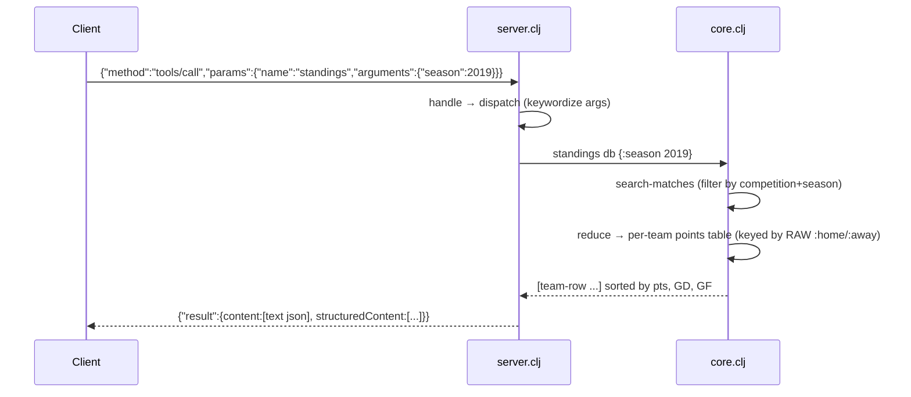

# Flow

`-main` loads all six CSVs once at startup into an in-memory `db`, then loops over
stdin lines. A `tools/call` for `standings` filters matches by competition
(default "Brasileirão") and season, then folds each match into a points table and
sorts by points, goal difference, then goals-for. The result is emitted as both MCP
text content and `:structuredContent`.

Deviations from common patterns worth noting:
- **Standings groups by the raw `:home`/`:away` string, not the normalized `team-key`** — so a club spelled two ways (e.g. "Athletico Paranaense" vs "Atletico Paranaense") splits into two rows even though the rest of the code normalizes team names for matching.
- **No cross-file deduplication**: the five match datasets are concatenated as-is (23,954 = their exact sum); the same fixture can appear in more than one file.
- CSV BOM stripping in `csv.clj:read-csv` uses a literal string, not a regex, so a real UTF-8 BOM on the first header would not be removed.
- No pagination beyond a hard `limit` cap; no auth; synchronous single-threaded request loop.
