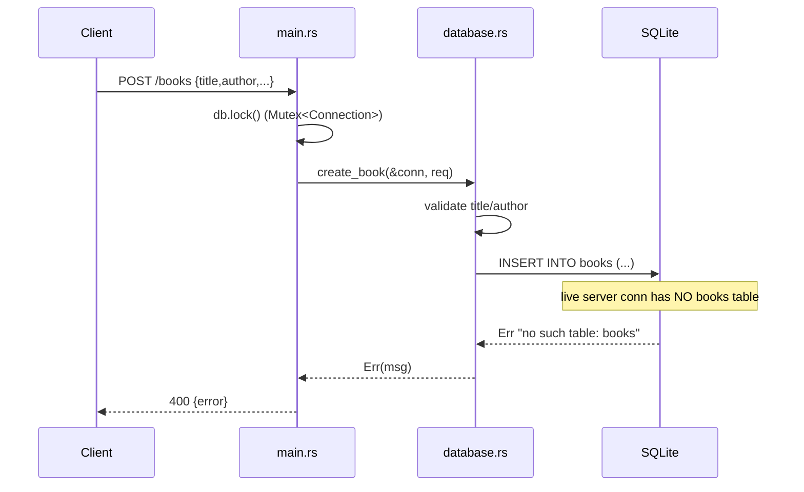

# Flow

A request to `POST /books` locks the shared `Mutex<rusqlite::Connection>`, validates that `title` and `author` are present and non-empty, then inserts a UUID-keyed row. Under `cargo test` the flow succeeds because each test builds its own connection and runs `TABLE_DEF` on it. **At runtime the live server is broken:** `main()` creates the served connection with `Connection::open_in_memory()` but never applies `TABLE_DEF` to it — the schema is instead created on a *separate*, immediately-discarded connection opened at path `"in-memory"` (`create_connection("in-memory").ok()`). So the served connection has no `books` table, and every DB-touching route would fail at runtime. This is the exact "schema created on a discarded connection" regression FEEDBACK.md flagged, and it was not fixed.
