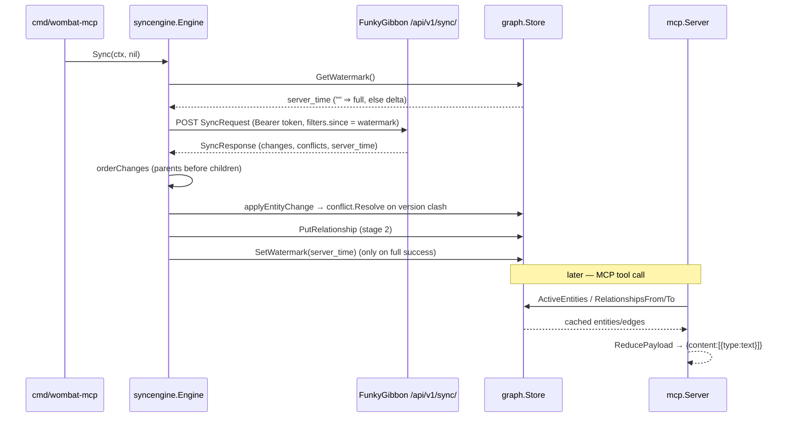

# Flow

Dominant flow: a delta sync round-trip that advances the exclusive watermark, then serves a tool call from the local cache.

The client persists the response `server_time` and replays it as a strictly-greater-than `filters.since` (never the local clock). Conflict resolution is last-write-wins on `updated_at` (derived from the version timestamp, since the wire form carries no `updated_at`); within a 1-second window the lexically greater `version` string wins. Deletes are tombstones (`content.deleted=true`), retained for sync but excluded from active queries. The cache is a single atomically-written JSON file, so state survives restarts; the graph store guards concurrent background-sync and tool access with a mutex. Initial sync and MCP serving are best-effort/decoupled: a sync failure logs to stderr and the tool surface still serves from the cache offline.
