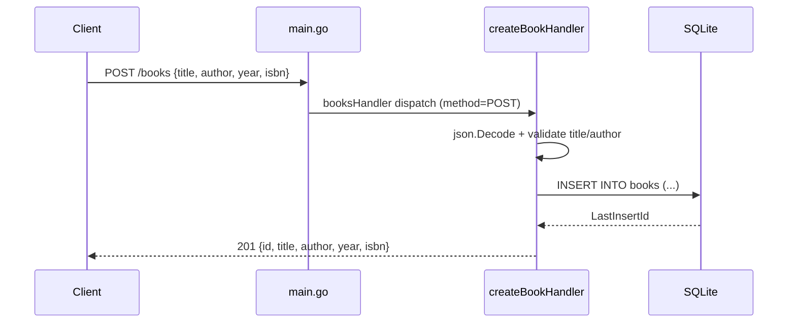

# Flow

A `POST /books` is routed by `booksHandler`, which switches on the HTTP method and delegates to `createBookHandler`. The handler decodes the JSON body, rejects the request with `400` if `title` or `author` is empty, then runs a parameterized `INSERT` against the SQLite `books` table and returns the created book (with its new id) as `201 Created`. Reads/updates/deletes on `/books/{id}` are handled by `singleBookHandler`, which parses the id from the path before dispatching. Notable: SQL uses parameterized queries throughout (no injection); an empty list response encodes as JSON `null` rather than `[]` because the `books` slice is left nil.
