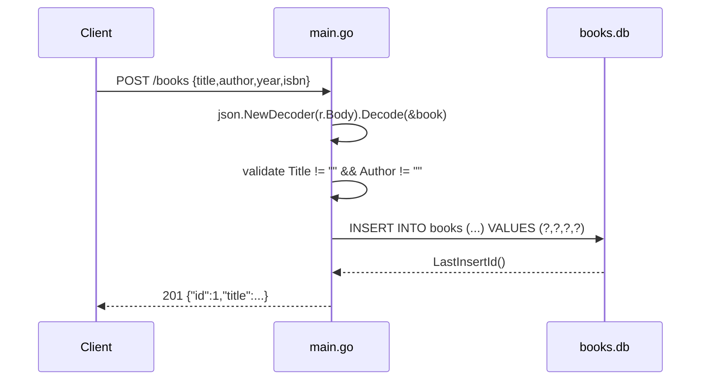

# Flow

`POST /books` is dispatched by the `/books` closure (`main.go:249`) on `r.Method == POST` into `createBook` (`main.go:123`). The body is decoded straight into the `Book` struct, `Title` and `Author` are checked for emptiness (`main.go:133`), and a parameterised `INSERT` writes the row. The generated id is read back with `LastInsertId()` and echoed in the `201` response.

Deviations from common patterns worth noting, all factual:
- Global `*sql.DB` (`main.go:26`) opened once in `initDB()`; no connection-pool tuning, no context propagation — every query uses the non-`Context` variants.
- Path ids are parsed with `strings.TrimPrefix` + `strconv.Atoi` rather than a router (`main.go:100`, `162`, `211`), so any extra path segment yields `400`, not `404`.
- Error responses go through `http.Error`, which emits plain text and resets `Content-Type` to `text/plain`, even though each handler set `application/json` first.
- Validation is presence-only: `year` and `isbn` are unchecked, and `PUT` requires the full object (no partial update).
- No middleware, no logging of requests, no graceful shutdown.
