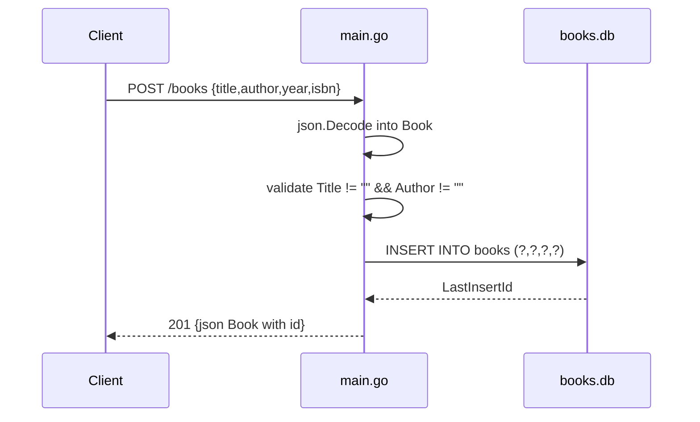

# Flow

`POST /books` decodes the body into `Book` (`main.go:62`), rejects malformed JSON with `400`,
enforces the title/author requirement with `400` (`main.go:72-75`), then inserts via a
parameterised `db.Exec` on the process-global `*sql.DB` opened in `initDB()` against the
on-disk `./books.db`. The new row id from `LastInsertId()` is written back onto the struct and
returned as `201` JSON. Notable deviations: there is no request context / timeout plumbing
(`db.Exec`, not `db.ExecContext`); the `{id}` path parameter in the other handlers is parsed by
`strings.TrimPrefix` + `strconv.Atoi` duplicated in three places rather than by a router; error
bodies are `http.Error` plain text rather than JSON; and `GET /books` encodes a nil slice as
`null` when the table is empty.
