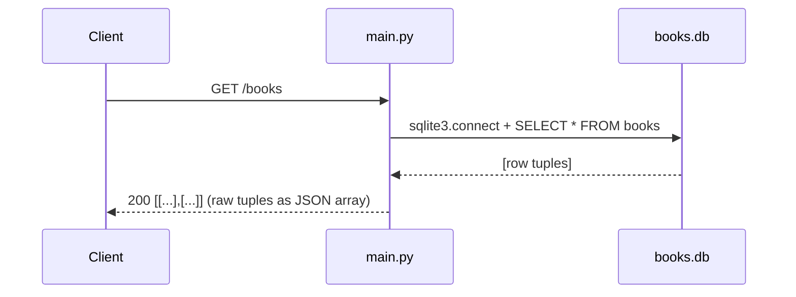

# Flow

The one fully-served data route is `GET /books`: `main.py:get_books` opens a fresh
`sqlite3` connection, runs `SELECT * FROM books`, and returns the raw `fetchall()` tuples,
which FastAPI serializes to a JSON array of arrays (not objects). `init_db()` is defined but
never called on startup, so `books.db` must already exist or the query raises. There is no
input validation, no error handling, no `?author=` filtering, and no create/update/delete
path in the served app — those operations exist only as unrouted functions in `book_api.py`.
