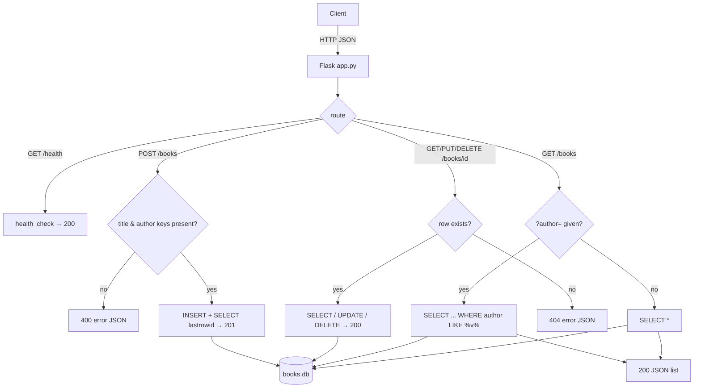

# Flow

A request opens a fresh `sqlite3` connection per handler, executes, and closes it
inline; there is no connection pool, ORM, blueprint, or app factory.

Startup: `init_db()` runs `CREATE TABLE IF NOT EXISTS` only from the `__main__`
guard, so an importer of `app` (including `test_app.py`) must call it explicitly.
