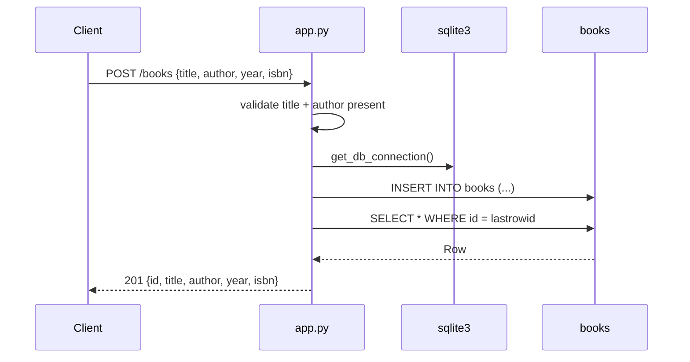

# Flow

`create_book` (`app.py:38`) reads the JSON body, rejects it with `400` when
`title` or `author` is falsy, opens a fresh `sqlite3` connection per request
(`row_factory = sqlite3.Row`), inserts the row, re-selects it by `lastrowid`,
closes the connection, and returns the persisted record with `201`.

Deviations from common patterns: no ORM and no connection pooling — every
handler opens and closes its own `sqlite3.connect(DATABASE)`; no app factory,
so the DB path is a module constant and cannot be overridden for tests; `year`
and `isbn` are accepted without type or format validation; each write handler
wraps its SQL in a bare `except Exception` that collapses any error to a generic
`500`; `PUT` is full-replace (it requires `title` and `author`, and nulls `year`
/`isbn` when omitted) rather than a partial update; `init_db()` runs only under
`__main__`, so an import-based deployment (e.g. a WSGI server) never creates the
table.
