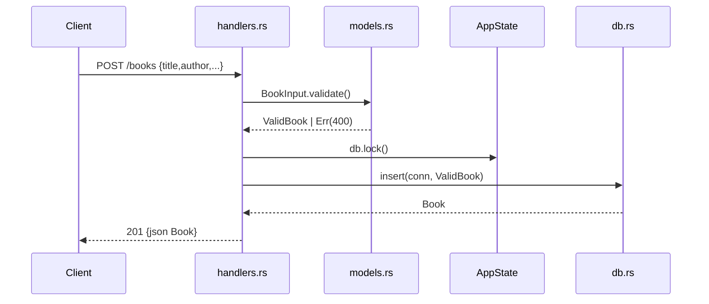

# Flow

A `POST /books` request is deserialized into `BookInput`; a `JsonRejection` on
malformed bodies is mapped to a 400 with a JSON error. `BookInput::validate()`
trims and requires non-blank `title` and `author` (and bounds `year`), returning
a `ValidBook` or a list of validation errors (400). The handler locks the shared
`Arc<Mutex<Connection>>`, calls `db::insert`, and returns 201 with the created
record. Unique-constraint violations on `isbn` surface as 409 Conflict via the
`From<rusqlite::Error>` mapping in `error.rs`. DB access is synchronous behind a
mutex inside async handlers.
