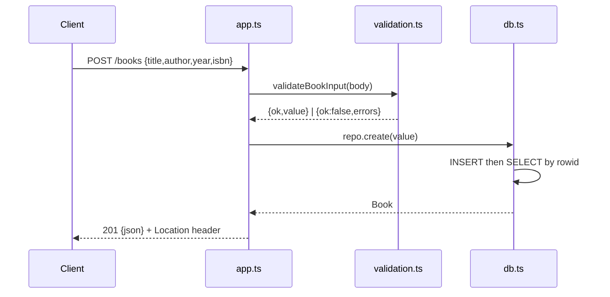

# Flow

A `POST /books` request is parsed by `express.json()`, validated by `validateBookInput` (title/author required, non-empty, ≤500 chars; year an integer in range; isbn matched against an ISBN-10/13 pattern). On failure the handler returns `400` with field-level errors and never touches the database. On success `BookRepository.create` inserts the row via a prepared statement and reads it back to return the persisted record (with server-generated `id`, `created_at`, `updated_at`), yielding `201` plus a `Location` header. Data persists to SQLite through Node's built-in `node:sqlite`; tests use a `:memory:` database. Notable: malformed JSON, oversized bodies, and repeated `?author=` params are all handled explicitly with appropriate status codes.
