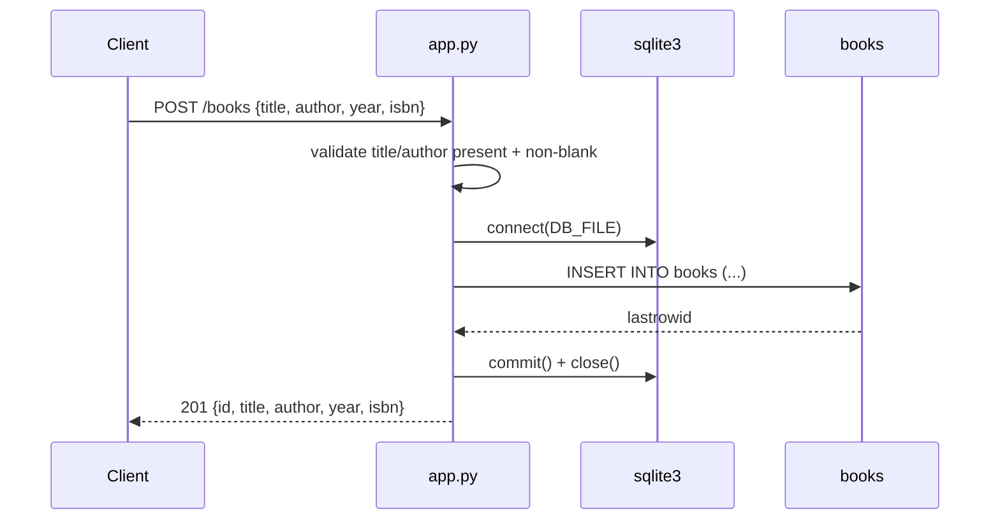

# Flow

`POST /books` parses the JSON body, rejects it with `400` when `title` or
`author` is absent or blank, then opens a fresh `sqlite3` connection per
request, inserts the row, reads `cursor.lastrowid` and echoes the created book
back with `201`. Each handler repeats this connect/execute/close cycle by hand;
there is no connection pool, no ORM, no request-scoped session, and no
`with`-block, so a raised exception outside the `try` leaks the connection
(`app.py:142-157`). Validation is present but string-typed — `title.strip()`
assumes a `str`, so a non-string `title` raises before the `try` and Flask
returns a `500` HTML page rather than JSON. The `?author=` filter is a
substring `LIKE '%...%'` match rather than equality. `init_db()` runs only under
`__main__` or when a test calls it, so the table is not created on import.
