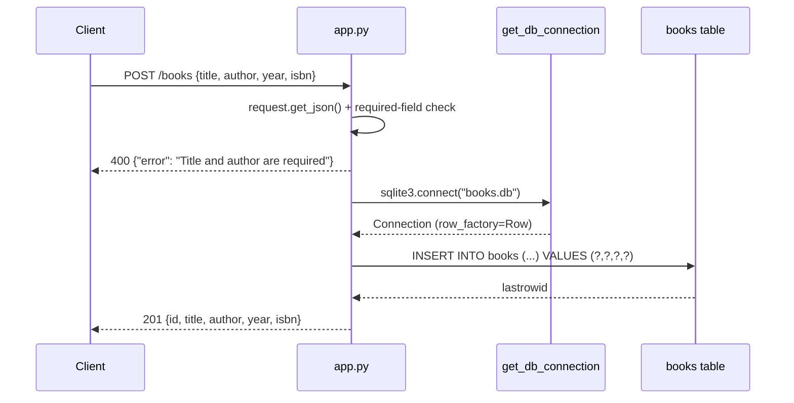

# Flow

`POST /books` parses the JSON body, rejects it with 400 unless both `title` and `author` are
present, then opens a fresh `sqlite3` connection to the file `books.db`, inserts a
parameterized row, and echoes the payload back with the new `lastrowid` as `id` and status 201.

Deviations from common patterns: a new connection is opened and closed per request (no pool);
validation is presence-only — no type checks on `year`, no ISBN format check, and an empty-string
title passes the `'title' not in data` test; `init_db()` runs only under `if __name__ ==
'__main__'` (and in the test fixture), so importing the app under a WSGI server leaves the table
uncreated; the `?author=` filter is a `LIKE '%…%'` substring match rather than an exact match;
the DB path is a fixed relative filename, so tests and the running service share one file.
