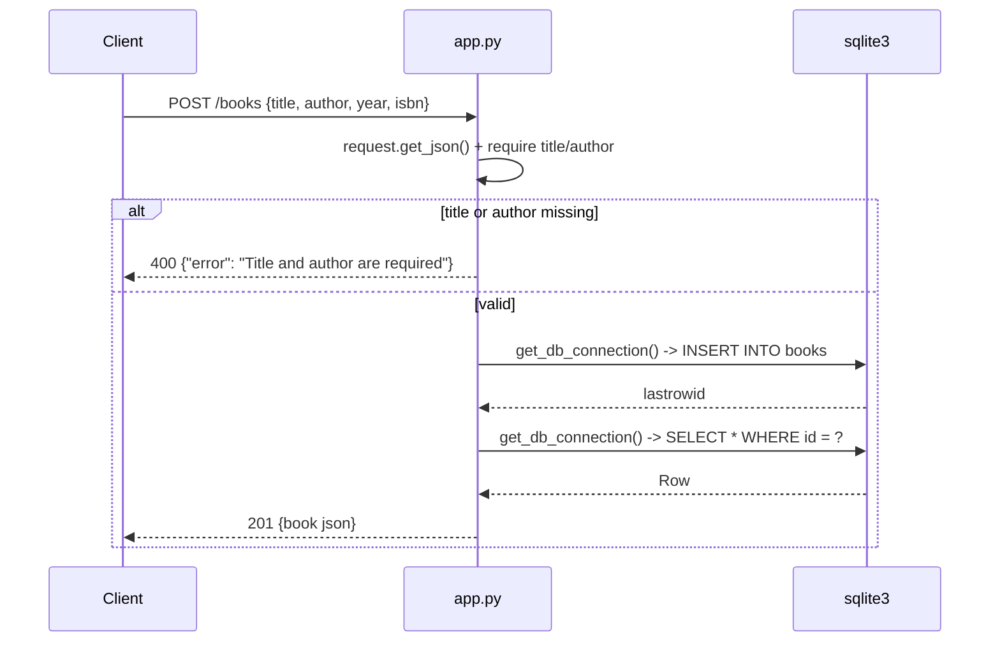

# Flow

`POST /books` parses the JSON body, rejects it with 400 unless both `title` and `author`
keys are present, then opens a `sqlite3` connection, INSERTs with bound parameters, closes
the connection, opens a **second** connection to SELECT the row back by `lastrowid`, and
returns it as JSON with 201. Deviations from the common pattern: no ORM (raw `sqlite3`
despite `Flask-SQLAlchemy` being declared in `requirements.txt`); no connection reuse or
`g`/teardown handling — every handler opens and closes its own connection, and `create_book`
opens two; validation is presence-only (an empty-string title passes); the DB path is a
module-level constant, not read from `app.config`; `init_db()` runs only under
`if __name__ == '__main__'`, so an import-based server start (gunicorn/`flask run`) would
hit a missing table.
