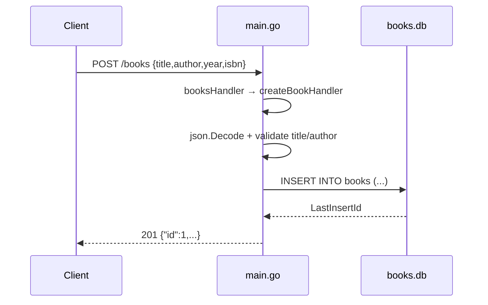

# Flow

`POST /books` enters through `booksHandler` (`main.go:60`), which switches on method and delegates to `createBookHandler` (`main.go:72`). The body is decoded into a `Book`; an empty `title` or `author` short-circuits to `400` (`main.go:85`). Otherwise a parameterised `INSERT` runs against the package-global `*sql.DB` opened in `initDB` (`main.go:31`), the generated row id is copied back onto the struct, and the book is written out as JSON with `201 Created`.

Deviations from common patterns: the DB handle is a package-level global rather than injected, so tests must call `initDB()` for their side effect and the previous handle is never closed (`main_test.go:16`). Queries are parameterised throughout (no string-concatenated SQL). Error handling uses `http.Error`, which emits `text/plain` bodies rather than JSON on the error paths. `getBooksHandler` accumulates into a nil-initialised slice, so an empty collection serialises as `null` rather than `[]` (`main.go:139`). There is no pagination, no request logging, no graceful shutdown, and no context/timeout plumbing on the DB calls.
