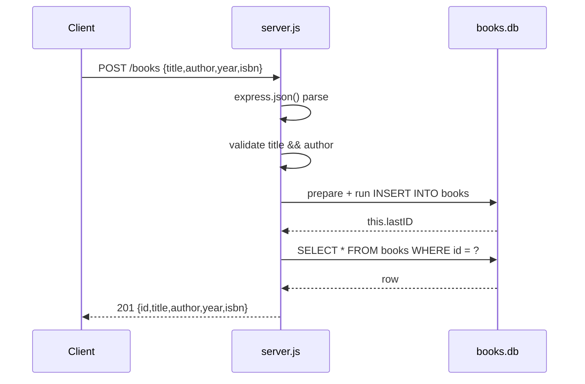

# Flow

`POST /books` parses the JSON body, rejects a missing `title` or `author` with `400` before touching the database, then issues a parameterized `INSERT` through a per-request prepared statement and re-reads the row by `this.lastID` so the response carries the generated id. All five CRUD routes follow the same shape: validate, parameterized SQL via the `sqlite3` callback API, map errors to `500` and empty results to `404`.

Deviations from common patterns: the prepared statements created per request (`server.js:48`, `:127`, `:159`) are never `finalize()`d and the database handle is never closed; callbacks are nested rather than promisified; `PUT` requires a full body (no partial update); `:id` is passed to SQL unvalidated, so a non-numeric id yields `404` rather than `400`; the database path is a fixed relative `./books.db` with no environment override, so every process sharing a working directory shares state.
