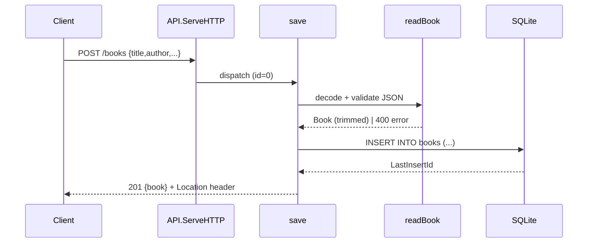

# Flow

A `POST /books` request is routed by `API.ServeHTTP` (a hand-written path
switch over `/health`, `/books`, and `/books/{id}`) to `save`. `readBook`
enforces a 1 MiB body limit, disallows unknown fields, rejects trailing JSON,
trims `title`/`author`, and requires both to be non-empty (else `400`). On
success `save` inserts the row, sets a `Location` header, and returns `201`
with the created book. The same `save` handler serves `PUT` (id > 0) via an
`UPDATE`, returning `404` when no row is affected. Notable: no pagination on
`GET /books`; the author filter is exact/case-sensitive; DB access is
synchronous with `SetMaxOpenConns(1)` and a 5s busy timeout.
