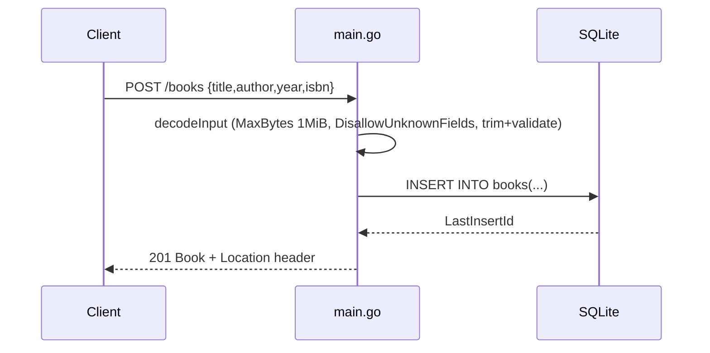

# Flow

A request to `POST /books` is routed by `API.ServeHTTP` on exact path `/books`. The body
is decoded by `decodeInput`, which caps the body at 1 MiB, rejects unknown fields and
trailing JSON, trims `title`/`author`, and returns `400` if either is empty. A valid
insert executes a parameterized `INSERT` (SQL-injection safe), then responds `201` with the
created `Book` and a `Location: /books/{id}` header. `DB.SetMaxOpenConns(1)` serializes
access; a `PRAGMA busy_timeout=5000` and table-level `CHECK` constraints back the
application-layer validation. Errors are returned as JSON `{"error":"..."}` with
appropriate status codes (400/404/405/500/503).
