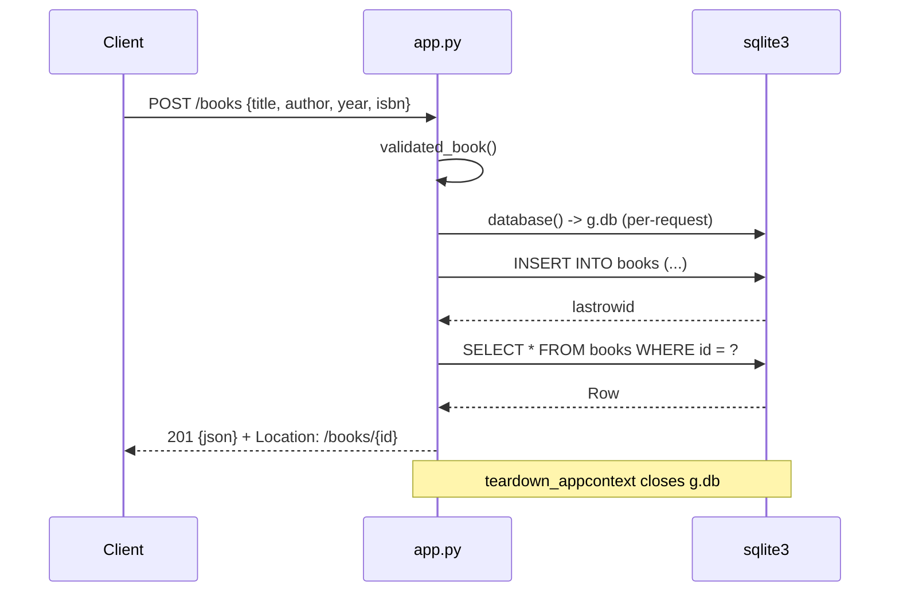

# Flow

A `POST /books` first runs `validated_book()` (`app.py:47`), which requires `title` and `author` to be non-blank strings, accepts `year` only as a strict `int` (`type(...) is not int`, so `True` is rejected) within the signed-64-bit range, and `isbn` only as a string or null. A `ValueError` from that function is converted to a 400 JSON body by the registered `ValueError` handler. On success the row is inserted through a per-request `sqlite3` connection stored on `g` and committed by the connection's context manager, then re-selected so the response body is exactly what the database holds. The connection is closed by `teardown_appcontext`.

Deviations from the common pattern worth noting, all factual: there is no ORM and no migration tool — the schema is a single `CREATE TABLE IF NOT EXISTS` executed inside `create_app`'s app context, so the table is (re)checked on every factory call. Parameterised SQL is used everywhere (a test asserts the `?author=` filter is not injectable). `find_book`, `update_book` and `delete_book` each guard `book_id > SQLITE_INTEGER_MAX` explicitly because Flask's `<int:...>` converter accepts arbitrarily large integers that SQLite cannot bind. There is no pagination, no auth, no logging, and no structured error taxonomy beyond `{"error": str}`.
