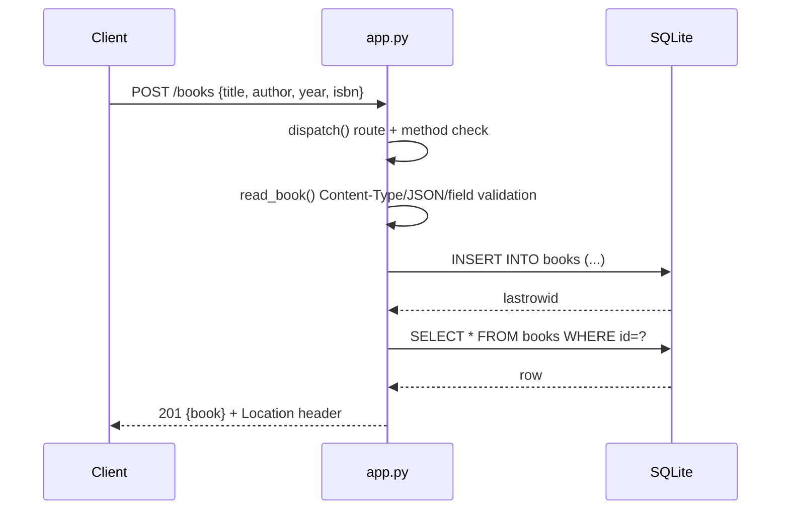

# Flow

A request to `POST /books` enters the single WSGI `__call__`, which delegates to `dispatch()`. `dispatch()` matches the path (`/books` vs `/books/{id}` vs `/health`) and checks the method against the allowed set (405 + `Allow` header otherwise). For a create, `read_book()` enforces `application/json`, a bounded body (1 MB, 413 above), valid JSON object, an allowed field set, non-blank string `title`/`author` (trimmed), and type-checked `year`/`isbn`. Values are inserted via a parameterized query (no string interpolation — SQL injection inputs are covered by tests), then the freshly-stored row is read back and returned as JSON with a 201 and a `Location` header. All handlers share one `connect()` context manager that wraps each request in a transaction and closes the connection; `sqlite3.Error` is caught centrally and returned as 503.
